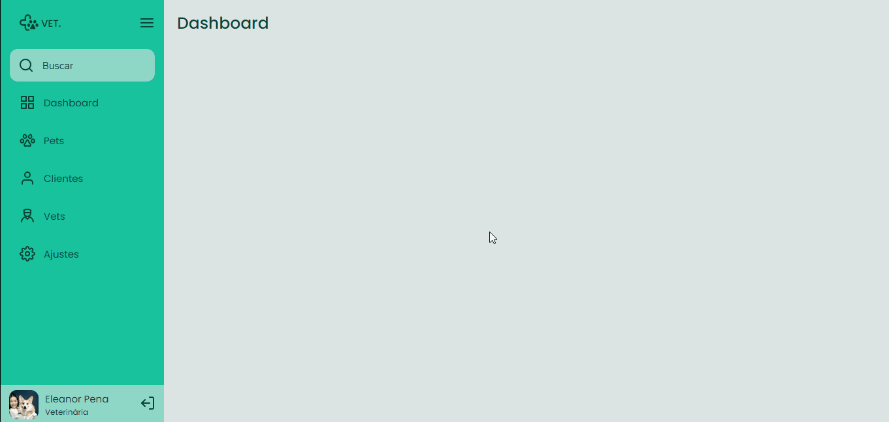

<h1 align="center"> Sidebar </h1>

 

  

## Sobre o desafio

Este foi um projeto extra com JavaScript disponibilizado no site de desafios para praticar os aprendizados de aula do curso Explorer da Rocketseat.   

## Tecnologias utilizadas

Esse projeto foi desenvolvido com as seguintes tecnologias:

- HTML
- CSS
- JavaScript
- Github
- Figma